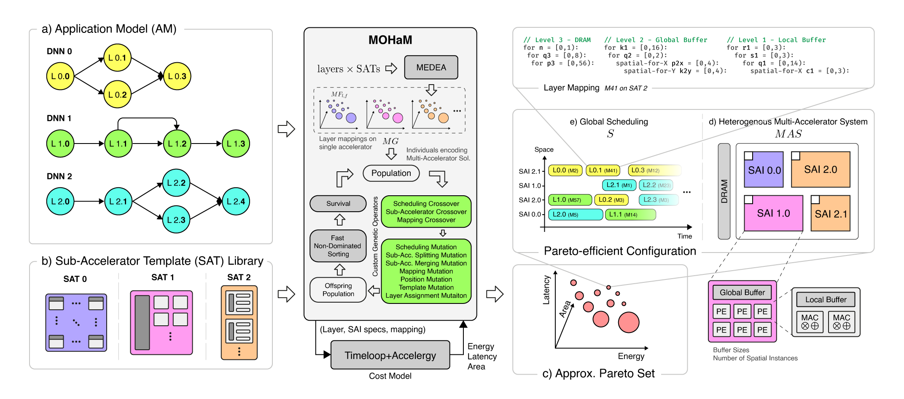

# MOHaM

## Multi-Objective Hardware-Mapping Co-Optimisation for Multi-DNN Workloads on Chiplet-based Accelerators.



## Setup
Clone repository
```shell
git clone --recurse-submodules https://github.com/Haimrich/moham.git
cd moham
```
Start Docker container. You can also use a [devcontainer](https://code.visualstudio.com/docs/devcontainers/tutorial). Alternatively, you can check [Dockerfile](docker/Dockerfile) and install dependencies in a Ubuntu system. 
```shell
cd docker
docker-compose run --rm moham bash
```
Compile MOHaM executable
```shell
cd moham
mkdir build && cd build
cmake .. && make -j8
```

## Run Example
```shell
cd experiments
./build/moham config.yaml -o ../output
```

## Plot Results

In the [scripts](scripts) folder you can find useful notebooks to plot the results.

## Citation

If you find this repository useful please cite:

> A. Das, E. Russo, and M. Palesi, ***[Multi-Objective Hardware-Mapping Co-Optimisation for Multi-DNN Workloads on Chiplet-Based Accelerators.](https://ieeexplore.ieee.org/abstract/document/10496454)*** in IEEE Transactions on Computers, vol. 73, no. 8, pp. 1883-1898, Aug. 2024, doi: 10.1109/TC.2024.3386067.

```BibTeX
@article{moham2024,
  author={Das, Abhijit and Russo, Enrico and Palesi, Maurizio},
  journal={IEEE Transactions on Computers}, 
  title={Multi-Objective Hardware-Mapping Co-Optimisation for Multi-DNN Workloads on Chiplet-Based Accelerators}, 
  year={2024},
  volume={73},
  number={8},
  pages={1883-1898},
  doi={10.1109/TC.2024.3386067}
}
```

